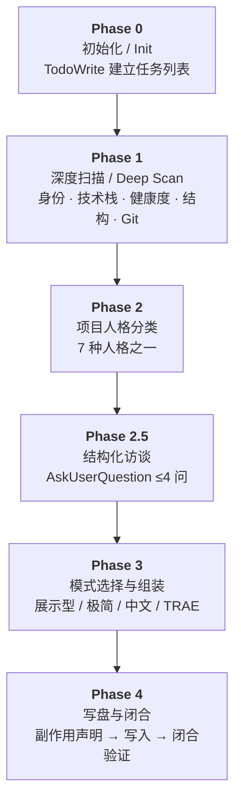

<div align="center">
  
</div>

<br />

<div align="center">

[](LICENSE)
[](https://www.trae.ai)
[](./SKILL.md)

</div>

<br />

---

## 这是什么 / What is this

<table>
<tr>
<td width="50%">

`acp-traetune-readme-skill` 是一个运行在 **TRAE（VS Code IDE）+ AC 范式**中的 README 自动生成 skill。它不是模板填充器——它会先**深度扫描**你的仓库（技术栈、项目结构、健康度、Git 历史），理解你的项目"是什么"，再按选定的视觉模式生成一份有产品感的 README。

</td>
<td width="50%">

`acp-traetune-readme-skill` is a README auto-generation skill running inside **TRAE (VS Code IDE) + AC Paradigm**. It doesn't fill templates — it first **deeply scans** your repository (tech stack, structure, health, Git history), understands what your project _is_, then generates a product-quality README.

</td>
</tr>
</table>

---

## 设计定位 / Design Philosophy

<table>
<tr>
<td width="50%">

本 skill 为 **TRAE IDE + AC 范式组件体系** 深度设计，建议配合以下组件使用以获得最佳体验：

- **AC Rules & Skills** — AC 闭环能力基座
- **GN-004** — 交付质量抽查节点（可选）
- **AC Pipeline** — 自动化 README 保鲜流程（可选）

在完整 AC 范式环境中运行时，skill 可获得完整的工具链语义、闭合判据自动验证、以及 GN-004 抽查流程。

</td>
<td width="50%">

This skill is deeply designed for the **TRAE IDE + AC Paradigm component ecosystem**. For the best experience, pair it with:

- **AC Rules & Skills** — AC closure capability foundation
- **GN-004** — Delivery quality spot-check node (optional)
- **AC Pipeline** — Automated README freshness workflow (optional)

When running within a full AC Paradigm environment, the skill benefits from complete toolchain semantics, automatic closure validation, and the GN-004 spot-check flow.

</td>
</tr>
</table>

> **跨平台 / 跨组件兼容性 · Cross-Platform Compatibility**
>
> 本 skill **并非无法独立驱动**——在非 TRAE 环境或缺少 AC 组件时仍可运行，但以下能力会降级：
>
> - `AskUserQuestion` 结构化访谈 → 降级为纯文本交互，失去选项约束
> - `TodoWrite` 任务追踪 → 降级为手动步骤管理
> - GN-004 质量抽查 → 不可用，需人工 checklist 替代
> - 闭合判据自动验证 → 降级为人工判断
>
> *This skill **can run standalone** — outside TRAE or without AC components — but the following capabilities degrade: structured interviews fall back to plain text, task tracking becomes manual, GN-004 spot-checks are unavailable, and closure validation requires human judgment.*

---

## 安装 / Installation

<div align="center">

**将本 skill 目录复制到项目的 `.trae/skills/` 下**

*Copy this skill directory into your project's `.trae/skills/`*

</div>

```
项目根目录/
└── .trae/
    └── skills/
        └── acp-traetune-readme-skill/
            ├── SKILL.md
            ├── README.md
            ├── icon.svg
            └── LICENSE
```

| 方式 / Method | 命令 / Command |
|:------------|:-------------|
| 手动复制 / Manual | 将 `acp-traetune-readme-skill/` 整个文件夹拖入 `.trae/skills/` |
| PowerShell | `Copy-Item -Path "acp-traetune-readme-skill" -Destination ".trae/skills/acp-traetune-readme-skill" -Recurse` |

> 安装后，当对话中出现 `生成 README` `写个 README` `更新 README` 等语义时，TRAE 自动触发此 skill。
>
> *After installation, TRAE triggers it automatically when you mention phrases like "generate README", "create README", or "update README".*

### 环境要求 / Requirements

| 要求 / Requirement |  |
|:---|---|
| **IDE** | TRAE (VS Code) |
| **操作系统 / OS** | Windows (PowerShell) / macOS / Linux |
| **Git** | `可选` Optional — 有 Git 时获取更多信号（tags、commits、remote URL） |
| **GitHub** | `完全可选` Fully Optional — badge 实时数据可选增强 |

---

## 使用方式 / Usage

### 触发 / Trigger

<div align="center">

*无需记住特定命令，说出意图即可 · No special commands needed — just say what you want*

</div>

| 中文 | English |
|------|---------|
| "帮我生成一个 README" | "Generate a README for me" |
| "给这个项目写个 README.md" | "Write a README.md for this project" |
| "更新一下 README，最近改了不少东西" | "Update the README, I've made a lot of changes" |
| "我的项目缺个 README，帮我补一个" | "My project is missing a README, can you add one?" |

### 工作流程 / Workflow



### 四种模式 / Four Modes

| 模式 / Mode | 适用场景 / Use Case | 包含内容 / Contents |
|:-----------|:-------------------|:-------------------|
| **展示型** Showcase `默认` | 开源项目、对外展示 | 完整 Hero · Badge · Feature Grid · Architecture · Health Scorecard · Footer |
| **极简** Minimal | 内部项目、小型工具 | 纯 Markdown：标题 + 安装 + 使用 + License |
| **中文** Chinese | 中文社区项目 | 所有章节标题和说明使用中文，badge 标签中文 |
| **TRAE** | 开发工具 / API | 专注技术栈和 API 文档，省略视觉装饰 |

> 模式可以组合使用（如"极简 + 中文模式"）。*Modes can be combined (e.g., "Minimal + Chinese").*

### 更新模式 / Update Mode

<table>
<tr>
<th>策略 / Strategy</th>
<th>触发条件 / Trigger</th>
<th>行为 / Behavior</th>
</tr>
<tr>
<td><b>Merge</b> 合并 <code>默认</code></td>
<td>README 含生成标记、结构未大变</td>
<td>仅更新 badge / 技术栈 / 健康度等动态部分，保留手写内容</td>
</tr>
<tr>
<td><b>Regenerate</b> 重建</td>
<td>语言/框架迁移、目录重组、无生成标记</td>
<td>备份旧版 → 从零重建，Phase 2.5 向用户确认变更</td>
</tr>
</table>

---

## 视觉组件 / Visual Components

<div align="center">

*以下组件在 **展示型模式** 中启用 · Available in **Showcase Mode***

</div>

<table align="center">
<tr>
<td align="center" width="25%">

### Hero Block

</td>
<td align="center" width="25%">

### Badge Bar

</td>
<td align="center" width="25%">

### Tech Stack

</td>
<td align="center" width="25%">

### Feature Grid

</td>
</tr>
<tr>
<td align="center">

Capsule Render 渐变波浪

项目人格自适应调色

</td>
<td align="center">

shields.io 状态徽章

仅生成实际支持的

</td>
<td align="center">

skillicons.dev 图标条

自动映射技术栈

</td>
<td align="center">

HTML 表格 + emoji

2×2 或 2×3 网格布局

</td>
</tr>
<tr>
<td align="center" width="25%">

### Architecture

</td>
<td align="center" width="25%">

### Directory Tree

</td>
<td align="center" width="25%">

### Health Scorecard

</td>
<td align="center" width="25%">

### Footer

</td>
</tr>
<tr>
<td align="center">

Mermaid 自动架构图

节点 emoji 映射

</td>
<td align="center">

emoji 标注目录树

带注释说明

</td>
<td align="center">

Unicode 进度条

5 维度 × 5 档评级

</td>
<td align="center">

渐变波浪收尾

贡献者链接

</td>
</tr>
</table>

---

## README 保鲜 / Freshness Checklist

<div align="center">

*当做了以下任一操作时，建议重新运行本 skill · Run this skill again when you:*

</div>

|  |  |  |
|:---|:---|:---|
| 新增或删除主要依赖 | 更换了构建工具或框架 | 添加了新的顶层目录或模块 |
| *Add/remove major deps* | *Switch build tool or framework* | *Add new top-level dirs or modules* |
| CI/CD 流程有变更 | 发布新版本 (git tag / release) | 距上次更新超过 30 天 |
| *Change CI/CD pipeline* | *Release a new version* | *30+ days since last update* |

---

## 升级来源 / Upgrade Provenance

<div align="center">

基于 [**readme-skill**](https://github.com/Sheshiyer/readme-skill) 进行 TRAE/AC 适配性重写 · 原作者 [**Sheshiyer**](https://github.com/Sheshiyer)

*TRAE/AC adaptation of [**readme-skill**](https://github.com/Sheshiyer/readme-skill) by [**Sheshiyer**](https://github.com/Sheshiyer)*

</div>

<br />

**关键适配 / Key Adaptations：**

| 维度 / Dimension | 变更 / Change |
|:-----------------|:-------------|
| **工具语义** Tool Semantics | `Bash/Write/Edit` → `Read/Grep/Glob/SearchCodebase/RunCommand`，本地扫描优先，GitHub 降级为可选增强 |
| **交互协议** Interaction | 开放式文本访谈 → `AskUserQuestion` 结构化选择题，匹配 AC 人机对齐原则 |
| **AC 闭环** AC Closure | 新增 `TodoWrite` 任务管理、三值状态协议、闭合判据、副作用声明、GN-004 触点 |
| **视觉依赖** Visual Deps | `pyfiglet` 由主路径降为可选，内置 box-drawing 模板替代；Craft Hook 自动提醒 → 文档化手动清单 |

> 旧 skill 的深度扫描逻辑、7 种项目人格分类、分层输出结构和 Update Mode（Merge/Regenerate）框架完整保留。
>
> *The original skill's deep scanning logic, 7 project personalities, layered output structure, and Update Mode framework are fully preserved.*

---

<div align="center">

## License

**[MIT](LICENSE)**

<br />


</div>
